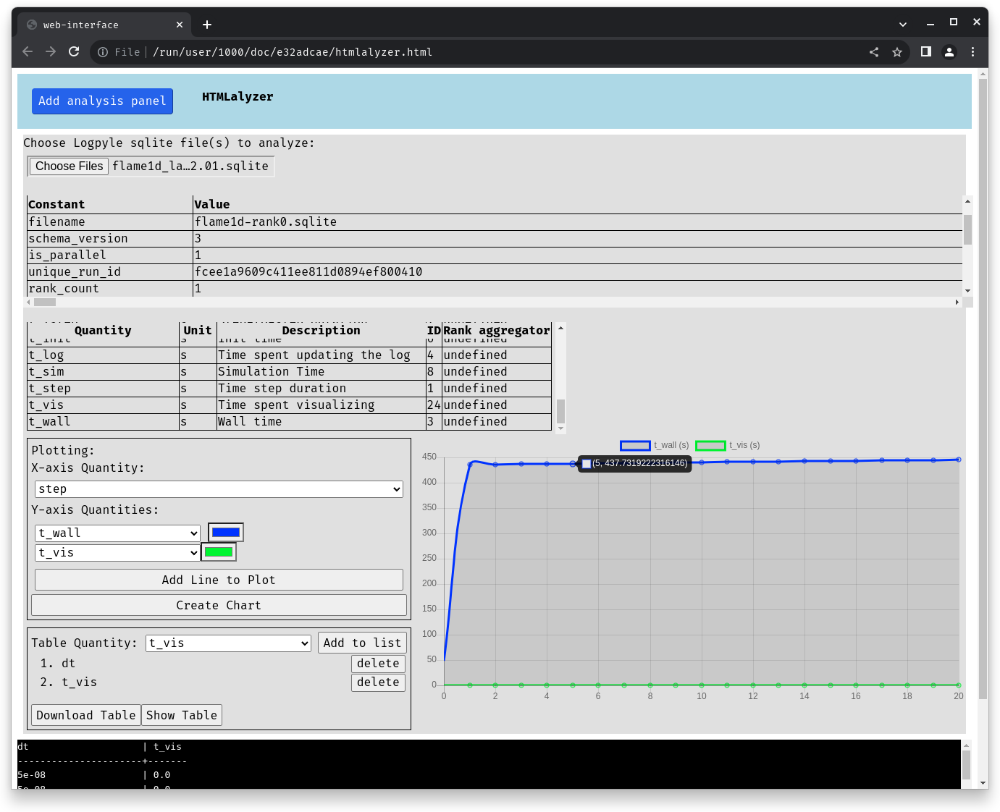

========
Analysis
========
Logpyle is distributed with tools that can assist in analyzing
data stored in its sqlite output files.

``runalyzer``, for analysis taking advantage of powerful SQL queries.

``runalyzer-gather``, for joining, or gathering, multiple sqlite
files into one.

``htmlalyzer``, for basic analysis benefiting from a GUI.

Runalyzer
=========
``runalyzer`` is a CLI tool that allows plotting, exporting, and viewing of
data in the form sqlite files exported by logpyle, all using SQL commands.

When running ``runalyzer`` without gathering sqlite files together,
``runalyzer`` will `auto gather` these files together and create an
in memory database as if ``runalyzer-gather`` had been run.

Magic commands are how we reduce our complex SQL schema to a friendly CLI
interface. When processing a command with mangling/magic enabled (Default
behavior), the command can be issued by preceding it with a ``.``. When referring
to a quantity, precede its name with a ``$``, under the hood, this ensures that
the quantity is gathered from all present run_ids.

Running the script
------------------
>>> runalyzer log.sqlite

Describing Schema
-----------------

``.constants``
    Show a list of (constant) run properties

    Parameters:
        None

    Ex:
        >>> .constants

``.quantities``
    Show a list of time-dependent quantities

    Parameters:
        None

    Ex:
        >>> .quantities

``.warnings``
    Show a list of warnings

    Parameters:
        None

    Ex:
        >>> .warnings

``.logging``
    Show a list of logging messages

    Parameters:
        None

    Ex:
        >>> .logging

Basic Usage
-----------

``.q SQL``
    Execute a (potentially mangled) query

    Parameters:
        SQL

    Ex:
        Grabbing quantities:
            >>> .q select $step, $dt

        Grabbing constants:
            >>> .q select date, machine

``.plot SQL``
    Plot results of (potentially mangled) query.
    Result sets can be (x, y) or (x, y, descr1, descr2, ...),
    in which case a new plot will be started for each
    tuple (descr1, descr2, ...)

    Parameters:
        SQL

    ex:
        >>> .plot select $step, $dt

``.scatter SQL``
    Make scatterplot results of (potentially mangled) query.
    Result sets can have between two and four columns
    for (x, y, size, color).

    Parameters:
        SQL
    Ex:
        >>> .scatter select $step, $dt

``.help``
    Show a help message

    Parameters:
        None

    Ex:
        >>> .help

Advanced Features
-----------------

Plotting multiple runs
^^^^^^^^^^^^^^^^^^^^^^

Plotting multiple runs by splitting run ids (look into schema)

To print constant run data of multiple runs that have been gathered, run the following
command:

>>> db.print_cursor(q("select * from runs"))

With the ids generated at time of gathering for each respective run, you may peel
out data from each run or multiple runs by specifying its id(s).

>>> .plot select $step,$dt where id=1

Running this command will plot dt(y) by step(x) from the first run given at time
of gathering.

You may also pull out data from multiple runs by relaxing the constant in the where
clause.

>>> .plot select $step,$dt where id=1 or id=2

Running this command will plot dt(y) by step(x) from the first two runs given at time
of gathering.

Issuing commands to Runalyzer
^^^^^^^^^^^^^^^^^^^^^^^^^^^^^

When running runalyzer, a common use case is to run a single command before
exiting. This can be accomplished by issuing the command as a string argument
to runalyzer.

>>> runalyzer summary.sqlite --command 'db.print_cursor(db.q("select $t_init.max"))'

When the user requires multiple commands to be issued,
In order to support issuing multiple commands, runalyzer allows the user to pass
in a script to be executed after loading the database.

.. code-block:: python

    # script.py

    db.print_cursor(db.q("select * from warnings"))
    db.print_cursor(db.q("select * from logging"))

>>> runalyzer summary.sqlite --script script.py

Runalyzer-gather
================
``runalyzer-gather`` takes in sqlite files from :mod:`logpyle` and combines them
all into a single sqlite summary file readable by ``runalyzer``.

Running the script
------------------
>>> runalyzer-gather summary.sqlite log.sqlite

HTMLalyzer
==========
``htmlalyzer`` is a GUI for quickly analyzing files :mod:`logpyle` sqlite files. It
features plotting multiple quantities together and analyzing multiple runs
at the same time.

HTMLalyzer uses PyScript, a framework that runs python in the browser and
runs Pyodide, CPython compiled to WebAssembly.

Running the script
------------------
>>> htmlalyzer

This will attempt to open a new tab in your default browser
allowing you to upload sqlite files to be analyzed.

passing in the ``--build`` flag will rebuild the HTML file
before serving it.

Usage
-----
After the virtual environment has been setup, click the ``Add file`` button
to add a pannel for analysis.

To analyze a run, click on the browse button to upload one or more files.
These files will be gathered together under the hood. You can then select
quantites from the X and Y dropdowns. If you would like to keep track of
multiple quantities in the same graph, you can press ``Add Line to Plot``
to add a Y dropdown.

The output chart is interactive. Hovering over points will display floating
point values, and you can toggle lines by clicking their name in the legend.

Any stdout from python will display in the terminal below any of the panels.

